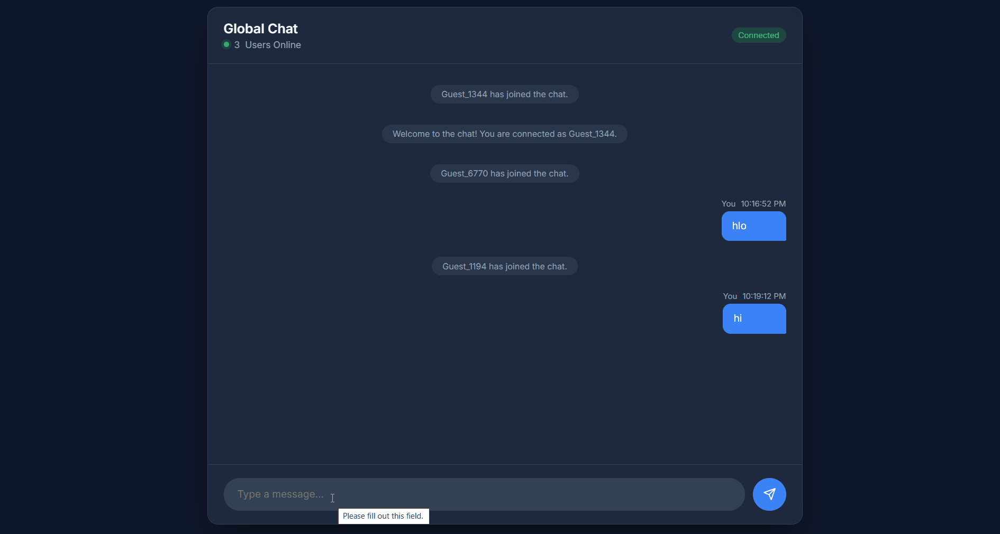
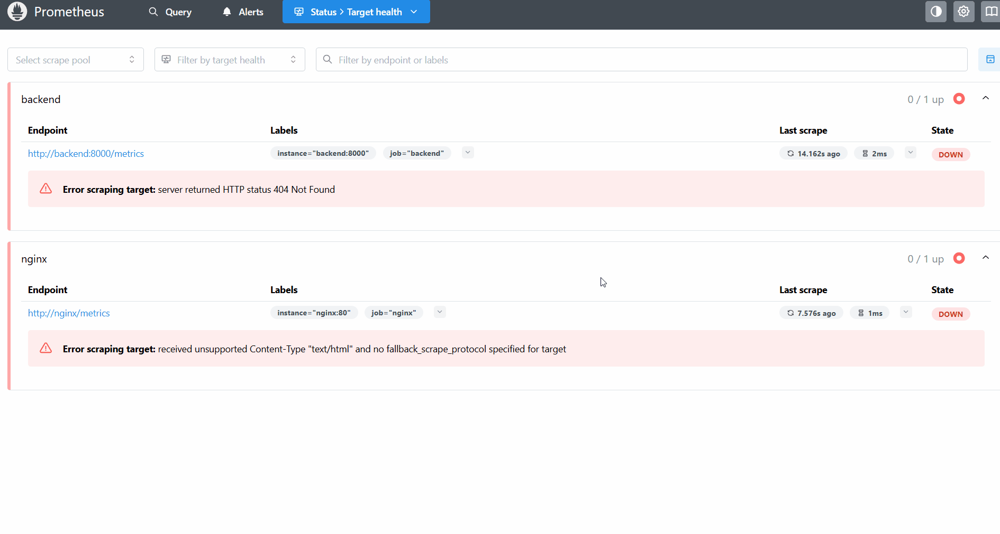

# DevOps Assignment — Real-Time WebSocket Chat Application


A production-grade deployment of a real-time WebSocket chat application using Docker, Nginx, GitHub Actions CI/CD and a full monitoring stack — deployed on AWS EC2.

**Live Application:** http://13.218.99.150

---

## Project Overview

This project involved debugging and fixing a deliberately broken deployment setup for a real-time WebSocket chat application. The application code was provided — the task was to identify and fix infrastructure issues, deploy to a cloud server, and automate deployments using CI/CD.

The original repository contained 3 deliberate bugs across `Dockerfile`, `docker-compose.yml` and `nginx.conf` that prevented the application from working. All 3 were identified, fixed and deployed to a live AWS EC2 instance with full CI/CD automation and monitoring.

---

## Architecture

```
User Browser
     │
     ▼
http://13.218.99.150 (AWS EC2 t3.micro — Ubuntu 24.04)
     │
     ▼
┌──────────────────────────────────────────────────────────┐
│                Docker Network (appnet)                   │
│                                                          │
│  ┌───────────────────────────────────────────────────┐  │
│  │              NGINX (Port 80)                      │  │
│  │   - Serves frontend HTML                          │  │
│  │   - Reverse proxies /ws to backend                │  │
│  └────────────────────┬──────────────────────────────┘  │
│                       │ proxy_pass backend:8000          │
│  ┌────────────────────▼──────────────────────────────┐  │
│  │         FastAPI + Uvicorn (Port 8000)             │  │
│  │   - Handles WebSocket connections                 │  │
│  │   - Manages real-time chat rooms                  │  │
│  └───────────────────────────────────────────────────┘  │
│                                                          │
│  ┌─────────────┐   ┌──────────────┐   ┌─────────────┐  │
│  │ Prometheus  │   │   Grafana    │   │  cAdvisor   │  │
│  │  Port 9090  │◄──│  Port 3000   │   │  Port 8080  │  │
│  └──────┬──────┘   └──────────────┘   └──────┬──────┘  │
│         └──────────────────────────────────── ┘         │
│                   scrapes metrics                        │
└──────────────────────────────────────────────────────────┘
```


---

## Multi-User Chat — Live Demo



---

## Issues Found and Fixed

### Bug 1 — Dockerfile: App bound to localhost

**Problem:** The app was started with `--host 127.0.0.1`, meaning it only listened on localhost inside the container. Nginx could not reach it from another container.

```dockerfile
# Before (broken)
CMD ["uvicorn", "main:app", "--host", "127.0.0.1", "--port", "8000"]

# After (fixed)
CMD ["uvicorn", "main:app", "--host", "0.0.0.0", "--port", "8000"]
```

### Bug 2 — docker-compose.yml: Frontend volume commented out + no network

**Problem:** The frontend volume mount was commented out so Nginx served its default page instead of the chat app. There was also no shared Docker network between containers so they could not communicate.

```yaml
# Before (broken)
# - ./frontend:/usr/share/nginx/html:ro
# No network defined

# After (fixed)
- ./frontend:/usr/share/nginx/html:ro

networks:
  - appnet

networks:
  appnet:
    driver: bridge
```

### Bug 3 — nginx.conf: WebSocket headers commented out + wrong proxy_pass

**Problem:** The WebSocket upgrade headers were commented out, breaking the WebSocket handshake. The proxy_pass pointed to `localhost` instead of the backend container name.

```nginx
# Before (broken)
proxy_pass http://localhost:8000/ws;
# proxy_set_header Upgrade $http_upgrade;
# proxy_set_header Connection "upgrade";

# After (fixed)
proxy_pass http://backend:8000/ws;
proxy_set_header Upgrade $http_upgrade;
proxy_set_header Connection "upgrade";
```

---

## How Docker Containers Are Set Up

The project uses 5 containers managed by Docker Compose:

**chat-backend** — built from the Dockerfile using Python 3.11-slim. Runs FastAPI with Uvicorn on port 8000. Only accessible within the Docker network, not exposed to the internet directly.

**chat-nginx** — uses nginx:alpine. Listens on port 80, serves the frontend HTML files and reverse proxies WebSocket connections to the backend container.

**prometheus** — scrapes metrics from cAdvisor every 15 seconds and stores them as time series data.

**grafana** — visualizes Prometheus metrics with pre-built dashboards showing per-container CPU, memory and network usage.

**cadvisor** — collects real-time resource metrics from all running Docker containers and exposes them to Prometheus.

All containers use `restart: always` so they automatically restart on crash or server reboot.

---

## How Docker Networking Works

All containers are connected to a custom bridge network called `appnet`. This allows them to communicate using container names as hostnames — no hardcoded IPs needed.

```
chat-nginx   ──┐
chat-backend ──┤
prometheus   ──┼── appnet (bridge network) 172.x.x.x/16
grafana      ──┤
cadvisor     ──┘
```

Nginx resolves `backend` directly to the backend container's internal IP. This is why `proxy_pass http://backend:8000/ws` works — Docker DNS handles the resolution automatically.

---

## How Nginx Reverse Proxy Works

Nginx handles two types of requests:

- Requests to `/` serve the static frontend HTML from `/usr/share/nginx/html`
- Requests to `/ws` are proxied to the backend container on port 8000

```nginx
location / {
    root /usr/share/nginx/html;
    index index.html;
    try_files $uri $uri/ /index.html;
}

location /ws {
    proxy_pass http://backend:8000/ws;
    proxy_http_version 1.1;
    proxy_set_header Upgrade $http_upgrade;
    proxy_set_header Connection "upgrade";
    proxy_set_header Host $host;
    proxy_read_timeout 86400s;
    proxy_send_timeout 86400s;
}
```

---

## How WebSocket Works Through Nginx

WebSocket connections start as a standard HTTP request with an `Upgrade` header. Nginx must forward these headers to the backend — otherwise the connection stays as plain HTTP and WebSocket fails.

The two critical headers are:
- `Upgrade: websocket` — tells the backend to upgrade the connection protocol
- `Connection: upgrade` — tells Nginx to keep the connection open and not close it after the response

Without these headers (which were commented out in the original config), the WebSocket handshake fails silently and the app shows as disconnected.

---

## How CI/CD Pipeline Works

Every `git push` to the `main` branch triggers the GitHub Actions workflow automatically:

```
git push → GitHub Actions triggered
              │
              ▼
         Checkout latest code
              │
              ▼
         SSH into EC2 (13.218.99.150)
         using stored secrets
              │
              ▼
         git fetch + reset --hard origin/main
              │
              ▼
         docker-compose down
         docker-compose up -d --build
              │
              ▼
         App live with latest changes
         in under 30 seconds
```

All credentials are stored as GitHub Actions secrets — `EC2_HOST`, `EC2_USER`, `EC2_KEY`. No credentials are hardcoded anywhere in the codebase.

---

## Monitoring (Bonus)

### Before — targets DOWN (no /metrics endpoint on app)



### After — targets UP with cAdvisor


The stack includes a full monitoring setup using cAdvisor + Prometheus + Grafana:

**cAdvisor** collects real-time metrics from all Docker containers including CPU usage, memory consumption, network I/O and filesystem usage — without any changes to application code.

**Prometheus** scrapes metrics from cAdvisor every 15 seconds and stores them as time series data.

**Grafana** visualizes the metrics using the cAdvisor dashboard (ID: 19792) showing per-container metrics for all 5 running containers.

| Service | URL | Credentials |
|---|---|---|
| Grafana | http://13.218.99.150:3000 | admin / admin |
| Prometheus | http://13.218.99.150:9090 | — |
| cAdvisor | http://13.218.99.150:8080 | — |

---

## Infrastructure as Code — Terraform (Bonus)

The `terraform/` directory contains Terraform configuration to provision the entire AWS infrastructure automatically instead of clicking through the AWS console.

**What it creates:**
- EC2 instance (t3.micro, Ubuntu 24.04)
- Security group with all required ports (22, 80, 443, 3000, 8080, 9090)
- User data script that auto-installs Docker and deploys the app on launch

```bash
cd terraform
terraform init
terraform plan
terraform apply
```

This means anyone can recreate the entire infrastructure from scratch with two commands — true Infrastructure as Code.

---

## Load Balancer Architecture (Bonus)

In a production environment with high traffic, a load balancer would sit in front of multiple backend instances:

```
User Browser
     │
     ▼
AWS Application Load Balancer (ALB)
     │
     ├──▶ EC2 Instance 1 (Nginx + Backend)
     ├──▶ EC2 Instance 2 (Nginx + Backend)
     └──▶ EC2 Instance 3 (Nginx + Backend)
```

For WebSocket connections, sticky sessions (session affinity) must be enabled on the ALB so a user stays connected to the same backend instance throughout their chat session.

---

## Auto-Scaling Approach (Bonus)

AWS Auto Scaling configured with:
- Scale out when CPU exceeds 70% for 2 minutes
- Scale in when CPU drops below 30% for 5 minutes
- Minimum 2 instances for high availability
- Maximum 6 instances to control costs

This ensures the chat application handles traffic spikes automatically without manual intervention.

---

## Steps to Deploy

### Prerequisites
- AWS EC2 instance (Ubuntu 24.04, t3.micro)
- Docker and Docker Compose installed
- Ports 80, 3000, 8080, 9090 open in security group

### 1. Clone the repository
```bash
git clone https://github.com/vivek1251/DevOps-Assignment.git
cd DevOps-Assignment
```

### 2. Run the application
```bash
docker-compose up -d --build
```

### 3. Access the application
```
Chat App:   http://<your-public-ip>
Grafana:    http://<your-public-ip>:3000
Prometheus: http://<your-public-ip>:9090
cAdvisor:   http://<your-public-ip>:8080
```

### 4. Enable auto-restart on server reboot
```bash
sudo systemctl enable docker
```

---

## Tech Stack

| Layer | Technology |
|---|---|
| Application | FastAPI + Uvicorn (Python 3.11) |
| Containerization | Docker |
| Orchestration | Docker Compose |
| Reverse Proxy | Nginx Alpine |
| Cloud | AWS EC2 (Ubuntu 24.04, t3.micro) |
| CI/CD | GitHub Actions |
| Metrics Collection | cAdvisor |
| Monitoring | Prometheus |
| Visualization | Grafana |
| IaC | Terraform |

---

## Project Structure

```
DevOps-Assignment/
├── app/
│   ├── main.py                    # FastAPI WebSocket application
│   └── requirements.txt           # Python dependencies
├── frontend/
│   └── index.html                 # Chat UI
├── terraform/
│   ├── main.tf                    # EC2 + security group provisioning
│   └── variables.tf               # Input variables
├── screenshots/
│   ├── chat-multiuser.gif         # Multi-user chat demo
│   ├── prometheus-before.gif      # Targets before fix
│   └── prometheus-after.gif       # Targets after cAdvisor
├── .github/
│   └── workflows/
│       └── deploy.yml             # CI/CD pipeline
├── Dockerfile                     # Container build instructions
├── docker-compose.yml             # Multi-container setup
├── nginx.conf                     # Reverse proxy configuration
├── prometheus.yml                 # Prometheus scrape config
├── architecture.png               # Architecture diagram
└── README.md
```

---

*Built by [Vivek Bommalla](https://github.com/vivek1251)*
 
